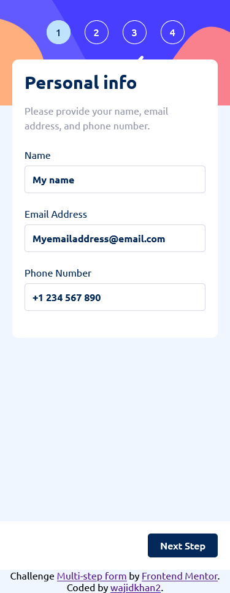
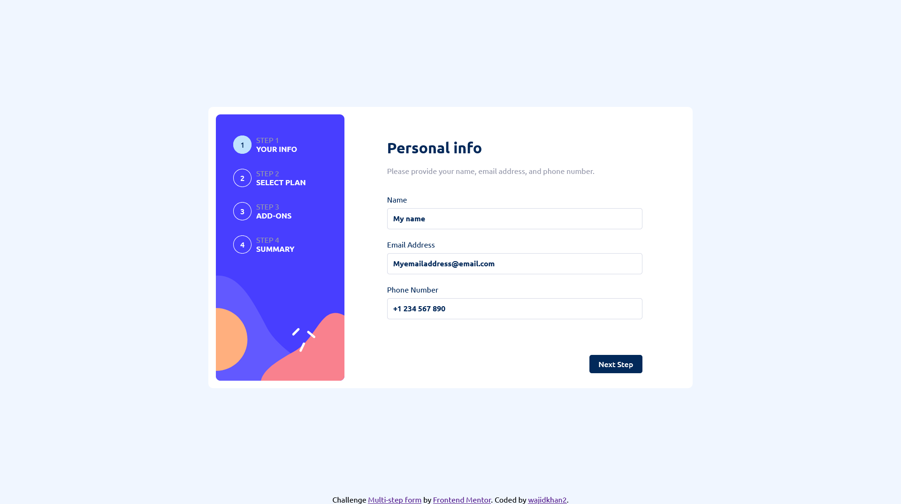

## Overview
This is my solution for front-end mentor challenge name: [Multi-step form](https://www.frontendmentor.io/challenges/multistep-form-YVAnSdqQBJ)

### Screenshot
Mobile view\

desktop view\

### Demo
[click Me](https://wajidkhan2-frontendmentor-challenges.github.io/multi-step-form-main/)

### Built with
- Mobile-first workflow
- Semantic HTML5 markup
- CSS custom properties
- JS and vue.js

### What I learned
I learned alot about accessibility and the use of aria properties

### further improvement
I would try to programe it a littel better for example take advantages vue list rendering and vue components
and making the error message more meaning full to screen readers.

### Author 
[wajidkhan2](https://github.com/wajidkhan2)
